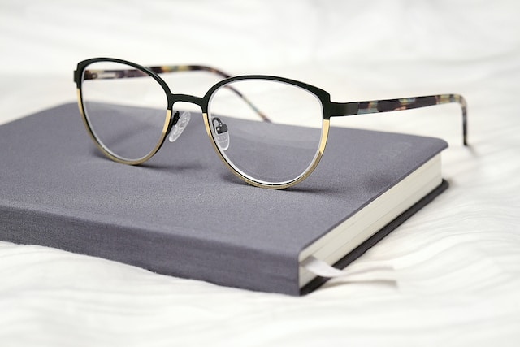

<h1> Object detection using yolov8 </h1>

Trained a YoloV8 model to detect two classes - Pen, Glasses </p1>

  
   

Training data and was used from Google open images

   

<h4>Training images:</h4>

  
  

<h4>Validation images:</h4>

  
  

<h2>Inference on new data:</h2>

  
  

  

